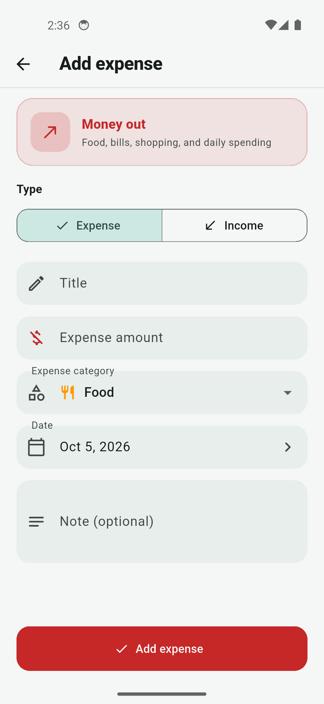
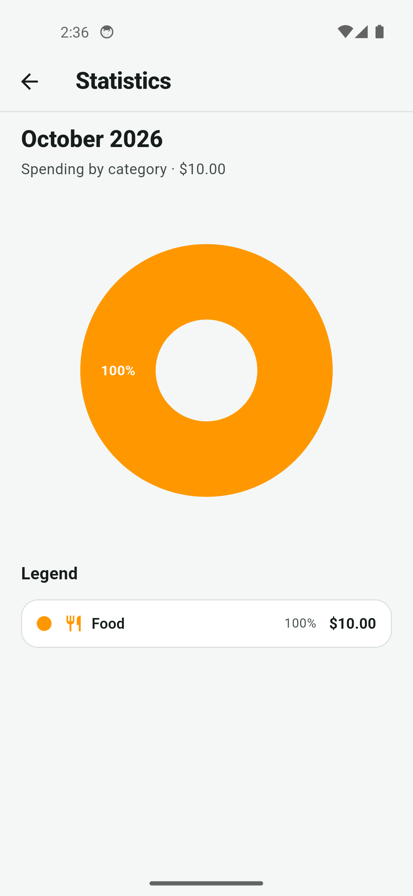

# SpendWise

Offline Flutter expense manager for tracking income and spending, with local SQLite storage, monthly summaries, charts, and CSV export.

## Features

- Add, edit, and delete income/expense transactions
- Category support (Food, Transport, Shopping, Bills, Health, Salary, Other)
- Monthly balance, income, and expense summary
- Search transactions by title, category, or note
- Swipe-to-delete with Undo
- Pie chart statistics by category for the selected month
- Light and dark themes (follows system setting)
- CSV export via the system share sheet
- Fully offline with SQLite (`sqflite`) and Riverpod state management

## Screenshots

Add screenshots under `screenshots/` and link them here:

| Home | Add / Edit | Statistics |
| --- | --- | --- |
|  |  |  |

> Tip: run the app, capture device screenshots, and save them as `screenshots/home.png`, `screenshots/add_edit.png`, and `screenshots/stats.png`.

## Stack

- Flutter + Dart
- [flutter_riverpod](https://pub.dev/packages/flutter_riverpod)
- [sqflite](https://pub.dev/packages/sqflite)
- [fl_chart](https://pub.dev/packages/fl_chart)
- [intl](https://pub.dev/packages/intl), [uuid](https://pub.dev/packages/uuid), [csv](https://pub.dev/packages/csv)
- [path_provider](https://pub.dev/packages/path_provider), [share_plus](https://pub.dev/packages/share_plus)

## Getting started

### Prerequisites

- Flutter SDK (3.13+ recommended)
- A device, emulator, or simulator

### Install & run

```bash
git clone https://github.com/Huzam229/SpendWise.git
cd SpendWise
flutter pub get
flutter run
```

### Tests

```bash
flutter test
```

### Generate launcher icons

```bash
flutter pub get
dart run flutter_launcher_icons
```

## Project structure

```text
lib/
  app.dart
  main.dart
  core/           # theme, constants
  data/
    db/           # SQLite helper
    models/       # Expense, Category
    repositories/ # CRUD
  providers/      # Riverpod state
  screens/        # Home, Add/Edit, Stats
  widgets/        # SummaryCard, ExpenseTile
  utils/          # formatters, CSV export
```

## License

This starter project is provided for learning and personal use.
